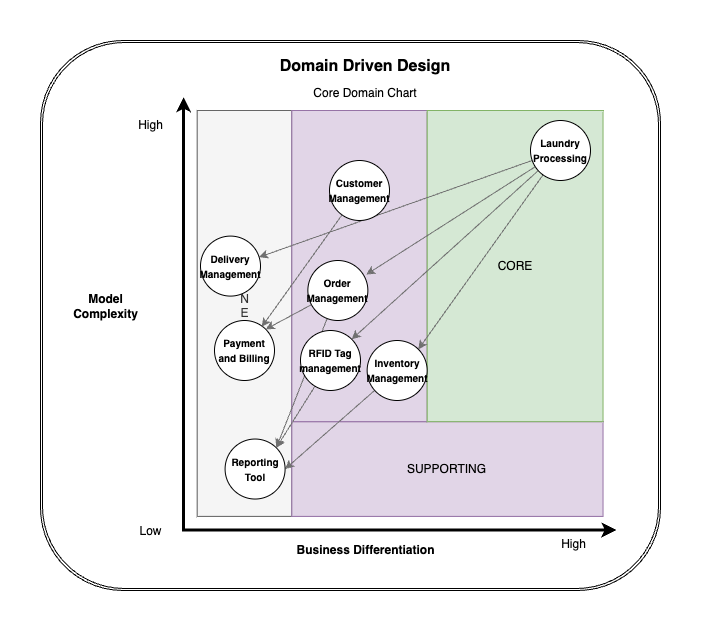

# Laundry-Management-MaxLaundry

MaxLaundry, a laundry management system, is a ionic (javascript framework) and .net project based on the use of RFID technology.
This is a 5 year old project with old dependencies and issues/bugs. I think this code will help me understand how to think before you code anything.

## 1. Git

I have previous experience using git and github as i have worked in a group environment. I usually prefer to integrate it with my IDE to not remember all sorts of commands and manually type it each time.

## 2. UML

### Use Case Diagram
This Use Case Diagram shows that interaction between actors

### Activity Diagram
This Activity Diagram shows the workflow of the system.

### Class Diagram

## 3. Domain Driven Design DDD

<!--  -->

## 4. Metrics (SonarCloud)

I have finished setting up Sonarcube in docker and config into the project 
In my experince the setup is diffuclut to follow.

I wasnt able the configure Sonarcube in my project. I instated used sonarCloud as an alternative integarted with github workflow pipelines.

First Scan

These are the metrics listed below : 

- Quality Gate Status 

- Bugs 

- Code Smells 

- Duplicated Lines 

- Lines of Code 

- Maintainability Rating 

- Security Rating 

## 5. Clean Code Development

[Personal-CCD cheat sheet](/CCD/CCD%20cheat%20sheet.pdf): find the the pdf here.

1. I have Clear Structure to my project, it is also humanly understandable where you can find the component

2. This is my API Services and it has proper meaningful name to understand the use of it with clear setions using comments 

3. Using the IDE the code has whitespace and formatting depending on the language used.

4. I like to breakdown my code into smaller bits(components) as it is easier to work with, but it also increases the number of file i need to make and remember.

5. usually I have some important configuration mentioned in a document. if i need refer to them in the future like using a open source library for RFID to read tags there are ports and device config required based on the manufacturer device 

## 6.& 7. Build and CI/CD (GitHub Action)
I have used GitHub-Actions for the build and Continuous Integration/Continuous Deployment.
i have made seperate workflows for each task that i want to accomplish.

[SonarCloud-Metrics](/.github/workflows/SonarCloud-Metrics.yml) : workflow to get sonarCould matrics from the main branch

[Build/Build2](/.github/workflows/Build2.yml) : workflow to build the Project

[Deploy](/.github/workflows/Deploy.yml) : workflow to deploy build to my windows server (errors)

[All workflows Runs](https://github.com/Mufaddalsr/Laundry-Management-MaxLaundry/actions)

## 8. Unit tests
I have imported XUnit module for unit testing. Asserting method is used to check whether actual value from database and the expected values are equal or not.
I have written 4 small unit tests. They are both based on API CRUD Operation. 

1. GetAll_GarmnetType_Success()

2. GetById_GarmnetType()

3. PostNew_GarmnetType()

4. Delete_Employee_Success()

## 9. IDE (VS code)

I have been using VS code as the main IDE for all types of development. It provides extensions which makes it easy to use.
Provides intelligent code completion, suggestions, and auto-completion, Syntax Highlighting, Built-in Git Integration, Integrated Terminal, Debugging.

Fav ShortCut
1. cmd+f : for fast search and getting a count for how many places we have used function etc..
1. shift+option+f : quickly format the code structure
1. command+shift+F8 : View Breakpoints.
1. option+enter : shows actions for the current context
1. cmd+ : Toggle the integrated terminal.

## 10. Domain Specific Language (DSL)

## 11. Functional Programming

I have written a small python program in the context of this project to demonstrate the concept of functional programming.

[Find the code here.](/functionalProgramming/main.py)

- [Side-Effect-Free Functions](https://github.com/Mufaddalsr/Laundry-Management-MaxLaundry/blob/main/functionalProgramming/main.py#L4) : add_item, remove_item, list_items function is side effect free function which performs curd opertions.

- [Closure](https://github.com/Mufaddalsr/Laundry-Management-MaxLaundry/blob/main/functionalProgramming/main.py#L43) : express_process function is an example of closure. create_order function has taken an anonymous and applied it. 

- [Higher-order function](https://github.com/Mufaddalsr/Laundry-Management-MaxLaundry/blob/main/functionalProgramming/main.py#L26) : The create_order function is a higher-order function because it takes another function (func) as an argument and applies it to each element.

- [Functions as Parameters and Return Values](https://github.com/Mufaddalsr/Laundry-Management-MaxLaundry/blob/main/functionalProgramming/main.py#L4) : add_item, remove_item, create_order takes in an argument and returns a result. This demonstrates the use of functions as return values.

